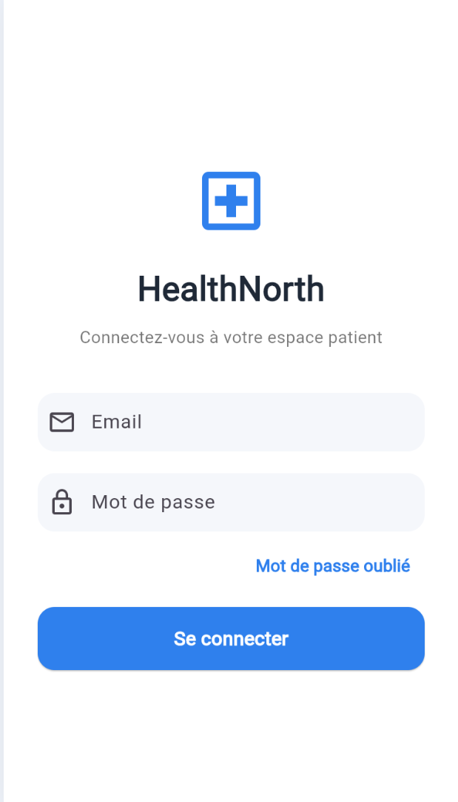

# HealthNorth Mobile



Application mobile développée en **Dart / Flutter** dans le cadre du BTS SIO – option SLAM.

Elle permet à un patient disposant d’un compte web d’accéder à ses informations de santé depuis une interface mobile.

---

##  Fonctionnalités

* 🔐 Authentification par token
* 👤 Consultation du profil patient
* 📅 Affichage des rendez-vous
* 💊 Consultation des prescriptions
* ⏰ Consultation des rappels
* ⚙️ Consultation des options

---

##  Technologies

* Dart / Flutter
* API REST (PHP)
* MySQL
* Git / GitHub

---

##  API

Une collection Postman est fournie :

 `docs/requettes api/healthnorth_mobile.postman_collection.json`
L’application mobile consomme une API REST développée dans le projet web associé.

 Accès au projet API :
https://github.com/moumintech/healthnorth-app/tree/main/api

---

##  Installation

```bash
flutter pub get
flutter run
```
