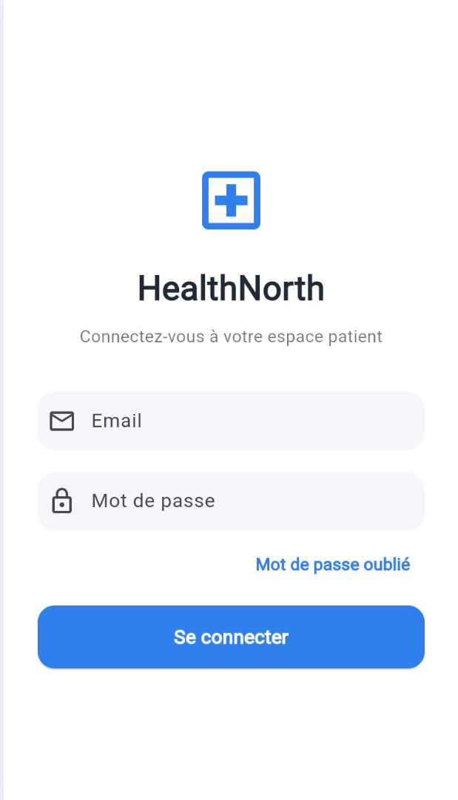

# HealthNorth Mobile



Application mobile développée en **Dart / Flutter** dans le cadre du **BTS SIO – option SLAM**.

Elle permet à un patient disposant d'un compte sur la plateforme HealthNorth d'accéder à ses informations de santé depuis un appareil Android via une interface mobile sécurisée.

---

## Fonctionnalités

| Fonctionnalité | Description |
|---|---|
| Authentification | Connexion par email/mot de passe avec token JWT |
| Profil patient | Consultation et modification du profil |
| Rendez-vous | Consultation des rendez-vous planifiés |
| Prescriptions | Accès aux ordonnances et médicaments prescrits |
| Rappels médicaments | Gestion des rappels avec activation/désactivation |
| Options | Paramétrage des préférences de l'application |

> Les modifications des données médicales sont effectuées uniquement via l'application web associée.

---

## Technologies

- **Dart / Flutter** – framework mobile multiplateforme
- **API REST PHP** – backend développé en PHP natif
- **MySQL** – base de données relationnelle
- **Git / GitHub** – gestion de version

---

## Structure du projet

```
healthnorth_mobile/
├── lib/
│   ├── config/          # Configuration (URL API, constantes)
│   ├── models/          # Structures de données (Patient, RDV, etc.)
│   ├── screens/         # Écrans de l'application
│   ├── services/        # Appels API (auth, patient, rappels…)
│   ├── widgets/         # Composants UI réutilisables
│   └── main.dart        # Point d'entrée de l'application
├── android/             # Projet Android natif (généré Flutter)
├── ios/                 # Projet iOS natif (généré Flutter)
├── docs/
│   ├── captures/        # Captures d'écran de l'application
│   ├── diagrammes/      # MCD, diagramme de classes
│   ├── maquettes/       # Maquettes PDF
│   ├── requettes api/   # Collection Postman + screenshots
│   └── sql/             # Script SQL de structure (sans données)
├── pubspec.yaml         # Dépendances Flutter
└── README.md
```

---

## Prérequis

- [Flutter SDK](https://docs.flutter.dev/get-started/install) ≥ 3.0
- Android SDK / Android Studio (pour l'émulateur ou un appareil physique)
- API HealthNorth déployée localement (WAMP/XAMPP) ou en ligne

---

## Installation et lancement

### 1. Cloner le dépôt

```bash
git clone https://github.com/moumintech/hn_mobile.git
cd hn_mobile
```

### 2. Installer les dépendances

```bash
flutter pub get
```

### 3. Configurer l'URL de l'API

Ouvrir `lib/config/api_config.dart` et adapter la valeur de `_host` :

| Contexte | Valeur |
|---|---|
| Émulateur Android | `10.0.2.2` |
| Appareil physique | IP locale de la machine (ex. `192.168.1.x`) |
| iOS simulateur | `localhost` |

```dart
static const String _host = '10.0.2.2'; // adapter selon le contexte
```

### 4. Lancer l'application

**Sur émulateur Android (via Android Studio ou ligne de commande) :**

```bash
# Vérifier les appareils disponibles
flutter devices

# Lancer sur l'émulateur détecté
flutter run

# Lancer sans mettre à jour les dépendances pub
flutter run --no-pub

# Lancer en release pour tester les performances
flutter run --release
```

**Sur appareil physique Android (USB) :**

```bash
# Activer le débogage USB sur l'appareil, puis :
flutter devices
flutter run -d <device_id>
```

**Installer un APK release directement :**

```bash
# Compiler l'APK
flutter build apk --release

# Installer via ADB
adb install -r build/app/outputs/flutter-apk/app-release.apk
```

---

## API associée

L'application mobile consomme une API REST développée dans le projet web HealthNorth.

- Dépôt du projet web : [moumintech/healthnorth-app](https://github.com/moumintech/healthnorth-app)
- Documentation des routes : [`documentation_api.md`](./documentation_api.md)

### Configuration de la base de données (côté API)

```bash
# Copier le fichier exemple
cp api/config/database.example.php api/config/database.php

# Renseigner vos identifiants dans database.php (ne jamais commiter ce fichier)
```

---

## Tests API

Une collection Postman est disponible dans [`docs/requettes api/`](./docs/requettes%20api/) :

- Endpoints documentés avec exemples de requêtes/réponses
- Les tokens ont été remplacés par `YOUR_TOKEN` pour la sécurité

---

## Documentation

| Ressource | Lien |
|---|---|
| Documentation API complète | [`documentation_api.md`](./documentation_api.md) |
| Diagramme de classes | [`docs/diagrammes/`](./docs/diagrammes/) |
| Maquettes | [`docs/maquettes/`](./docs/maquettes/) |
| Captures d'écran | [`docs/captures/`](./docs/captures/) |
| Script SQL (structure) | [`docs/sql/healthnorth.sql`](./docs/sql/healthnorth.sql) |

---

## Sécurité

- Les mots de passe utilisateurs sont hashés en **bcrypt** côté API
- L'authentification utilise des **tokens Bearer** transmis en header HTTP
- Les fichiers de configuration contenant des identifiants réels sont exclus du dépôt (`.gitignore`)
- Le fichier `api/config/database.php` n'est **jamais commité** — utiliser `database.example.php` comme référence

---

## Remarque

Les dossiers `android/`, `ios/`, `build/` et `.dart_tool/` sont en grande partie générés automatiquement par Flutter.  
Le développement principal est concentré dans le dossier `/lib`.

---

*Projet réalisé dans le cadre du BTS SIO – option SLAM — 2025/2026*
